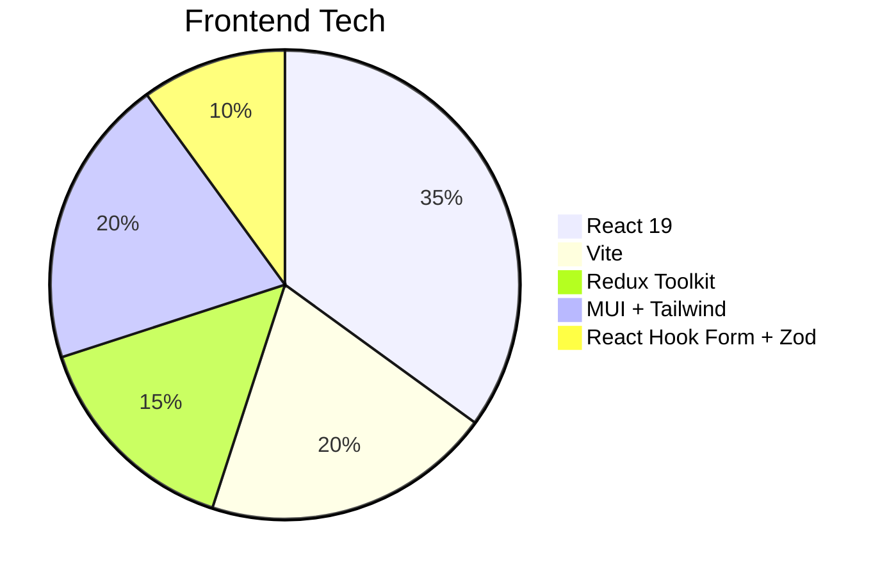
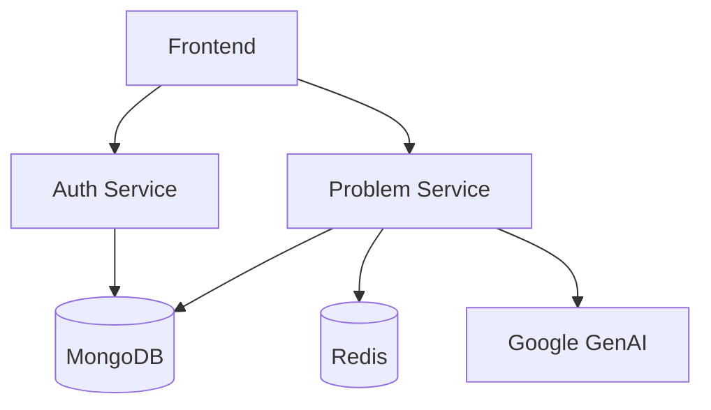

Here's a comprehensive **README.md** for your project, including documentation, tech stack, and setup instructions:

```markdown
# WriteCode - Full-Stack Coding Platform 🚀

[](https://opensource.org/licenses/MIT)
[](https://microservices.io)

A LeetCode-style platform with AI-powered coding assistance, featuring:
- Problem solving interface with real-time output
- User authentication (Google/GitHub/Email)
- Admin dashboard for problem management
- Microservices backend architecture

## 🌟 Features
**Frontend:**
- Monaco Editor integration
- JWT-based authentication
- Redux state management
- TailwindCSS styling
- Multi-tab problem interface (Description, Solutions, AI Chat)

**Backend Services:**
1. **Authentication Service**: OAuth2 (Google/GitHub), Email verification
2. **Problem Service**: CRUD operations, submissions, AI integration (Google GenAI)

## 🛠 Tech Stack
**Frontend:**


**Backend (Microservices):**
- **Core:**
  - Node.js (Express)
  - MongoDB (Mongoose)
  - Redis (Caching/Sessions)
- **Auth Service:**
  - Passport.js (OAuth)
  - JWT + Cookie-based sessions
  - Nodemailer (Email verification)
- **Problem Service:**
  - Google GenAI integration
  - Submission evaluation system

## 🚀 Installation
### Prerequisites
- Node.js v18+
- MongoDB Atlas URI
- Redis server
- Google OAuth credentials

### Setup
1. **Clone Repo**
```bash
git clone https://github.com/yourusername/writecode.git
cd writecode
```

2. **Frontend Setup**
```bash
cd frontend
npm install
cp .env.example .env # Update VITE_API_URL
npm run dev
```

3. **Backend Services**
```bash
# Authentication Service
cd auth-service
npm install
cp .env.example .env # Add MongoDB/Redis/OAuth keys
npm run dev

# Problem Service (in another terminal)
cd problem-service
npm install
cp .env.example .env
npm run dev
```

## 📂 Project Structure
```
frontend/
├── src
│   ├── components/      # Reusable UI components
│   ├── pages/           # Route-level pages
│   ├── store/           # Redux configuration
│   └── utils/           # Axios client, helpers

auth-service/
├── src
│   ├── config/          # DB/Redis/OAuth configs
│   ├── controllers/     # Business logic
│   └── models/          # MongoDB schemas

problem-service/
├── src
│   ├── controllers/     # Problem & AI logic
│   └── routes/          # API endpoints
```

## 🔍 Documentation
### High-Level Design


### Key Components
1. **AI-Powered Problem Solving**:
   - Google GenAI integration for code explanations
   - Submission history tracking

2. **Auth Flow**:
   ```mermaid
   sequenceDiagram
       User->>Frontend: Login (Google/GitHub)
       Frontend->>Auth Service: OAuth token
       Auth Service->>MongoDB: Verify/Create user
       Auth Service-->>Frontend: JWT cookie
   ```

3. **Problem Evaluation**:
   - Test case validation
   - Real-time output comparison
